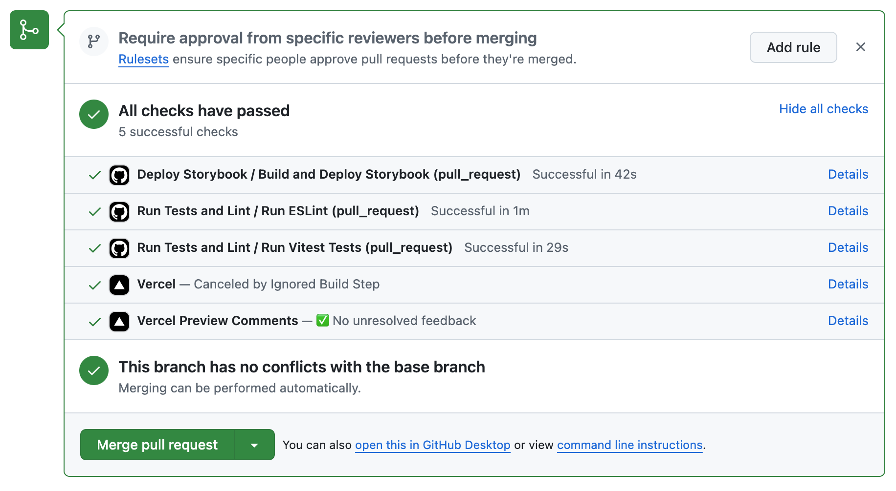
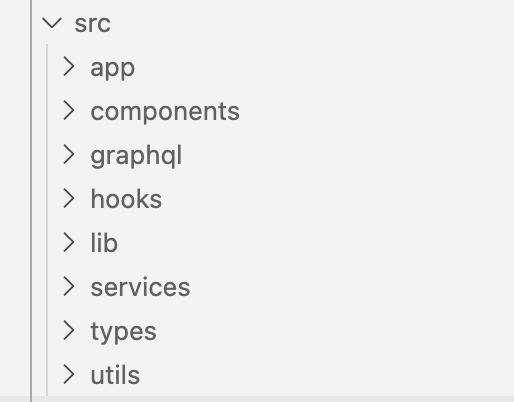
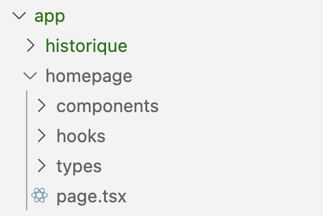

## 🚀 RocketRace


👉 Pour jouer a **Rocket Race**  :  [Jouer maintenant](https://rocketrace.quentinberanger.com/)   ou    [https://rocketrace.quentinberanger.com/](https://rocketrace.quentinberanger.com/) 


<table>
  <tr>
    <td>
      
    </td>
    <td>
      <strong>RocketRace</strong> est une application web développée avec <strong>NextJS</strong>, conçue pour interagir avec un serveur <strong>GraphQL</strong> afin de simuler des courses de fusées en temps réel.  
      <br><br>
      Inspirée par l'esthétique rétro des <strong>bornes d'arcade des années 80</strong>, l'application offre une expérience visuelle immersive avec des animations pixelisées et une ambiance futuriste.
    </td>
  </tr>
</table>

<p align="center">
  
</p>

<br/>

## 🌟 Ce que vous pouvez faire

- **🎯 Sélectionnez vos fusées favorites**  
  Choisissez parmi une liste d'options uniques, chacune avec son propre style et ses caractéristiques.

- **🚀 Lancez des courses en temps réel**  
  Profitez d'une intégration directe avec le serveur **GraphQL** pour suivre l'évolution des courses en direct.

- **🎮 Revivez l'excitation des jeux d'arcade**  
  Plongez dans un univers où la nostalgie des **bornes d'arcade des années 80** est enrichie par des animations modernes et pixelisées 🚀✨

<br/><br/>

---


## 🎥 Preview


<p align="center">
  <table style="table-layout: fixed; width: 80%; margin: auto;">
    <tr>
      <td align="center" style="width: 50%;">
        
        <br>
        <strong>Selection & Simulation</strong>
      </td>
      <td align="center" style="width: 50%;">
        
        <br>
        <strong>Historique & Suivi </strong>
      </td>
    </tr>
  </table>
</p>

<br>
<br>


# Lancer le projet

Ce projet propose deux environnements : **développement** et **production**, chacun avec ses propres fichiers `Dockerfile` et `docker-compose`.


### Environnement de Développement

Pour lancer le projet en mode développement :

```bash
docker compose -f docker-compose.dev.yml up --build -d
```
Ce mode permet de voir les changements en temps réel pendant que vous développez.
Les conteneurs sont reconstruits et redémarrés à chaque exécution.

 <br/>

### Environnement de Production

Pour lancer le projet en mode production, où tout est optimisé pour être déployé sur un serveur :

```bash
docker compose -f docker-compose.prod.yml up --build -d
```
Utilisez cette commande pour tester le comportement de l’application en conditions réelles directement sur Docker.

<br/>

### Lancer uniquement le Frontend

Si vous souhaitez travailler uniquement sur le frontend sans lancer les conteneurs Docker, procédez comme suit :

```bash
cd ./app && npm install && npm run dev
```

<br/>

# 🔧 Stack Technique

#### Développement Frontend
- **Next.js** : Framework React pour le rendu côté serveur et les applications modernes.
- **React** : Librairie JavaScript pour construire des interfaces utilisateur interactives.
- **TypeScript** : Super-ensemble de JavaScript pour un typage statique et une meilleure maintenabilité du code.
- **TailwindCSS** : Framework CSS utilitaire pour un développement rapide et des designs modernes.
- **Clsx** : Simplifie la gestion conditionnelle des classes CSS dans les composants.

#### Outils de Build et de Qualité
- **Turbopack** : Outil de développement rapide pour optimiser les performances.
- **ESLint** : Outil de linting pour identifier et corriger les erreurs de code.
- **Prettier** : Formateur de code pour garantir un style de code uniforme.
- **Next.js Lint** : Configurations spécifiques pour respecter les bonnes pratiques avec Next.js.
- **Storybook** : Permet de développer, tester, et documenter les composants en isolation avec une interface dédiée.


#### Gestion de Données et API
- **Apollo Client** : Gestionnaire de requêtes GraphQL pour le frontend.
- **GraphQL** : Langage de requête structuré pour interagir avec l'API.
- **GraphQL-WS** : Gestion des abonnements en temps réel pour GraphQL.
- **Zustand** : Librairie de gestion d'état légère et efficace.
- **GraphQL Codegen** : Génération automatique des types TypeScript et des hooks GraphQL pour un code fortement typé.

#### Tests et Qualité Logicielle
- **Vitest** : Framework de tests rapide et moderne pour exécuter des tests unitaires et d'intégration.
- **Testing Library** : Suite d'outils pour tester les composants React de manière axée sur l'expérience utilisateur, avec des assertions DOM et des simulations d'interactions utilisateur.

#### Déploiement et Infrastructure
- **AWS Lightsail** : Hébergement du backend via des conteneurs Docker.
- **Vercel** : Déploiement automatique du frontend avec gestion simplifiée des builds.

#### Intégration Continue
- **GitHub Actions** : Automatisation des tests, de l'analyse de code (ESLint), du déploiement Storybook, et de la génération de types GraphQL avec Codegen.


<br/>
<br/>

# 🚀 CI/CD Pipeline

L'application **Rocket Race** dispose d'un pipeline d'intégration et de déploiement continu bien structuré ! Voici les détails 👇


##  **Frontend (Next.js)**

- **Déploiement automatique :**  
  L'application est déployée automatiquement via **Vercel** à chaque push sur la branche **main** de GitHub.  
  - **URL du sous-domaine :** [rocketrace.quentinberanger.com](https://rocketrace.quentinberanger.com/)

##  **Backend (Node.js)**

- **Hébergement :**  
  Le backend est hébergé sur **Amazon Lightsail** avec deux conteneurs Docker  
  - **Images utilisées :** 
    - [Redis](https://hub.docker.com/_/redis) 
    - L'image de notre serveur graphql (dossier /graphql) 

- **Commande de build du conteneur :**
```bash
docker build --platform linux/amd64 -t my-nodejs-image .
```

- **Commande pour l’envoi de l’image sur Amazon Lightsail : :**
```bash
aws lightsail push-container-image --region eu-west-3 --service-name container-service-1 --label my-nodejs-image-label --image my-nodejs-image:latest
```

- **Point d’entrée (port 80) :**  
  Accessible en HTTPS :  
  [container-service-1.5w9nttkswwxhj.eu-west-3.cs.amazonlightsail.com](https://container-service-1.5w9nttkswwxhj.eu-west-3.cs.amazonlightsail.com)

🎯 **Tester l’API GraphQL**  
- **URL d’accès à l’API :**  
  [https://container-service-1.5w9nttkswwxhj.eu-west-3.cs.amazonlightsail.com/graphql](https://container-service-1.5w9nttkswwxhj.eu-west-3.cs.amazonlightsail.com/graphql)


## **GitHub Actions**

### **Storybook Deployment**
- Déploie automatiquement **Storybook** sur **GitHub Pages** après chaque push sur les branches **main** et **dev**.
- **URL du Storybook :** [quentingit.github.io/RocketRace](https://quentingit.github.io/RocketRace/)

### **ESLint Check**
- Vérifie automatiquement la qualité du code avec **ESLint** après chaque push ou pull request sur les branches **main** et **dev**.

### **Vitest Tests**
- Exécute automatiquement les tests unitaires avec Vitest après chaque push ou pull request sur les branches main et dev pour garantir la stabilité du code.




<br/>
<br/>

# 🗂️ Structure 

 


| **Dossier**      | **Description**                                                                                      |
|-------------------|--------------------------------------------------------------------------------------------------|
| `app/`           | Contient la structure des pages principales de l'application, incluant des routes dynamiques comme `/race/[id]`. Inclut les sous-répertoires pour des fonctionnalités comme `historique`, `homepage` et `selection`. |
| `appTypes/`      | Déclare des types enrichis spécifiques à l'application (fichiers comme `enrichedTypes.ts`), pour une meilleure gestion des données. |
| `components/`    | Regroupe tous les composants réutilisables, tels que `Header`, `Footer`, `LoadingIndicator` ou des éléments spécifiques comme `Asteroids` et `AudioPlayer`. Chaque composant est organisé dans son propre dossier. |
| `graphql/`       | Centralise les fichiers liés à GraphQL, incluant les requêtes (`queries.ts`), mutations (`mutations.ts`) et abonnements (`subscriptions.ts`) pour une interaction structurée avec l'API. |
| `hooks/`         | Contient des hooks personnalisés pour encapsuler des logiques spécifiques, comme `useAudio` et `useWindowSize`. |
| `lib/`           | Fournit des fichiers de configuration ou de logique réutilisable, tels que `apollo-client.ts` pour la configuration d'Apollo Client. |
| `providers/`     | Contient des composants pour fournir des contextes ou des dépendances globales, comme `ClientApolloProvider.tsx`. |
| `store/`         | Implémente des stores Zustand, par exemple pour la gestion de l'historique des courses (`useRaceHistoryStore.ts`) ou des données audio (`useAudioStore.ts`). |
| `transformers/`  | Inclut des fonctions de transformation pour manipuler les données récupérées de l'API, comme `transformRaceData.ts` ou `transformRocketData.ts`. |
| `__generated__/` | Contient les fichiers générés automatiquement (comme les types GraphQL). Ce dossier ne doit généralement pas être modifié manuellement. |


### **Modularisation par Feature**


 


Ce projet suit une structure **feature-based** :
- Chaque fonctionnalité (comme `historique` ou `homepage`) est isolée dans son propre dossier.
- Chaque dossier regroupe **les composants**, **les hooks**, **les services**, **les types**, et **les pages** associés à cette fonctionnalité.
- Les **tests** (`.test.tsx`) et les **stories** Storybook (`.stories.ts`) sont directement inclus avec les composants pour plus de clarté et de proximité.

 **Intégration avec Storybook et Tests**
- Les composants incluent systématiquement des stories pour Storybook (`.stories.ts`) afin de faciliter leur documentation et visualisation isolée.
- Les tests unitaires sont présents dans les mêmes dossiers sous forme de fichiers `.test.tsx`, alignés avec chaque composant.

| **Dossier/Fichier** | **Description**                                                                                     |
|----------------------|----------------------------------------------------------------------------------------------------|
| `components/`        | Contient tous les composants spécifiques à cette fonctionnalité.   <br/> - Chaque composant est accompagné de ses fichiers associés : une story pour Storybook (`.stories.ts`), un test unitaire (`.test.tsx`), et son fichier principal (`.tsx`). |
| `hooks/`             | Regroupe des hooks personnalisés pour encapsuler la logique métier propre à cette fonctionnalité.  <br/> - Permet de simplifier et de réutiliser la logique dans les composants ou autres parties de la fonctionnalité. |
| `types/`             | Déclare les types TypeScript spécifiques à cette fonctionnalité.   <br/> - Définit les interfaces et les types nécessaires pour les données manipulées ou affichées dans cette fonctionnalité. |
| `page.tsx`           | Fichier principal de la page (point d'entrée)  <br/> - Importe le composant principal de la fonctionnalité (par exemple, `Historique`).  <br/> - Inclut la fonction `generateMetadata` pour définir le titre et la description (SEO) de la page.                                |
 


L'utilisation des alias dans le fichier `tsconfig.json` permet un **accès rapide et organisé** aux différents dossiers.


Alias dans `tsconfig.json` :

```json
{
  "compilerOptions": {
    ...
    "paths": {
      "@components/*": ["src/components/*"],
      "@graphql/*": ["src/graphql/*"],
      "@hooks/*": ["src/hooks/*"],
      "@lib/*": ["src/lib/*"],
      "@services/*": ["src/services/*"],
      "@types/*": ["src/types/*"],
      "@utils/*": ["src/utils/*"]
    }
    ...
}
```
<br/><br/>


# 🖥️ Les Écrans de l'Application 

| **Écran**            | **Description**                                                                                                                                                                                                                                          |
|-----------------------|----------------------------------------------------------------------------------------------------------------------------------------------------------------------------------------------------------------------------------------------------------|
| **Page d'Accueil**    | - Simule une télévision rétro avec un bouton “Allumer” (géré avec `sessionStorage` pour n'afficher qu'une seule fois).<br>- Une fois allumé, mène à l'écran principal.<br>- **Accès direct** : possibilité de se rendre à la page de sélection ou à l'historique. |
| **Page de Sélection** | - Permet de **sélectionner deux fusées** parmi une liste récupérée via une **query GraphQL**.<br>- Affichage des fusées avec nom, image et description.<br>- **Gestion d’état** : Zustland stocke les fusées sélectionnées, prêtes pour le lancement.                                               |
| **Page de Course**    | Affiche une course en **temps réel** avec suivi des positions grâce aux **GraphQL Subscriptions**.<br><br> **Deux modes d’accès possibles** :<br>  1. Depuis la page de sélection : les données sont récupérées via **Zustand**.<br>  2. Par une URL directe : les données sont récupérées via une **query GraphQL**.<br><br> **État de la course** :<br>  - **Course en cours** : progression en direct suivie de l’affichage des résultats (avec **query** et **subscriptions**).<br>  - **Course terminée** : affichage uniquement de l’écran de résultat (avec **query**).<br><br> **Gestion des résultats** :<br>  - Si une fusée atteint l’arrivée, elle est déclarée **gagnante**.<br>  - Si une fusée explose, l’adversaire est déclaré **gagnant**, avec un écran adapté. |                                                                                                       |
| **Page d’Historique** | - Liste toutes les courses effectuées avec détails sur les fusées participantes.<br>- Indique si la course est terminée ou toujours en cours.<br>       |


<br/><br/>


# 🚀 Gestion de la Persistance des Données

Dans **RocketRace**, la persistance des données est un enjeu majeur pour garantir une expérience fluide, que ce soit pour les courses, l'écran d'accueil, ou l'historique. Voici les choix techniques adoptés pour gérer ces aspects.


## **1. Gestion des Données de Course avec Zustand**

### Contexte
Initialement, un **Context** React a été utilisé pour gérer la persistance des données entre la sélection des deux vaisseaux et le lancement de la course sur une nouvelle page. Cependant, cette approche ne permettait pas de **recharger la page** sans perdre les données, ce qui nuisait à l'expérience utilisateur.

### Solution
L'utilisation de **Zustand** a été choisie comme alternative légère à Redux pour une gestion efficace et simple de l'état global. Avec l'ajout de la **middleware persist**, les données sont automatiquement sauvegardées dans le **localStorage**, permettant ainsi de :
- Maintenir la persistance des données en cas de rechargement de page.
- Offrir une configuration minimale sans la complexité d'autres outils comme Redux.

### Exemple de Code avec Zustand
Voici un exemple de gestion des données d'une course avec **Zustand** et la middleware **persist** :

```typescript
import { RaceEnriched } from "src/types/enriched";
import { create } from "zustand";
import { persist } from "zustand/middleware";

type RaceStore = {
  raceData: RaceEnriched | null;
  setRaceData: (data: RaceEnriched | null) => void;
  resetRaceData: () => void;
};

const useRaceStore = create<RaceStore>()(
  persist(
    (set) => ({
      raceData: null as RaceEnriched | null,
      setRaceData: (data: RaceEnriched | null) => set({ raceData: data }),
      resetRaceData: () => set({ raceData: null }),
    }),
    {
      name: "race-storage", // Clé utilisée dans le localStorage
    }
  )
);

export default useRaceStore;
```

Dans un composant, l’utilisation est simple :


```typescript
const raceData = useRaceStore((state) => state.raceData);
const setRaceData = useRaceStore((state) => state.setRaceData);
const resetRaceData = useRaceStore((state) => state.resetRaceData);
```

## 2. Gestion de l’Historique des Courses

### Contexte
Au départ, l’historique des courses (tableau de scores) était stocké dans le **localStorage**. Cependant, avec l’introduction de **Zustand**, j'ai décidé d’utiliser le même store pour centraliser la gestion de ces données.

### Solution avec Zustand
En utilisant **Zustand** avec la middleware **persist**, l’historique est sauvegardé de manière persistante et accessible en permanence. Cela permet de :
- Centraliser la logique d’état global pour une meilleure maintenabilité.
- Réduire la dépendance à des appels directs au **localStorage**.
- Simplifier la gestion des données à travers l'application.

## 3. Gestion de l’Écran d’Accueil avec Session Storage

### Contexte
L’écran d’accueil, représentant une télévision rétro avec un bouton **“Allumer”**, nécessite une persistance limitée au **cycle de vie de l’onglet**. Il est essentiel que cet écran ne s’affiche qu’une seule fois par onglet, même si l’utilisateur revient sur la page d’accueil.

### Solution
Le **sessionStorage** a été utilisé pour répondre à ces besoins spécifiques, car il permet de :
- **Persister des données uniquement pour l’onglet en cours.**
- **Supprimer les données dès que l’onglet est fermé.**

Grâce à cette approche, l’écran d’accueil ne réapparaît pas après avoir été vu une fois, offrant une expérience utilisateur fluide et immersive.

```typescript
useEffect(() => {
  const hasSeenOverlay = sessionStorage.getItem("hasSeenOverlay");
  if (!hasSeenOverlay) {
    setShowOverlay(true);
  } else {
    setShowOverlay(false);
  }
}, []);

const handleOverlayClose = () => {
  setIsPoweringOn(true); // Animation d'allumage
  setTimeout(() => {
    setShowOverlay(false);
    sessionStorage.setItem("hasSeenOverlay", "true"); // Marquer comme vu
  }, 2000); // Durée de l'animation
};

```

<br/><br/>

# 🌐 Gestion Données : Intégration GraphQL & Transformation Données
<br/>


L'application utilise intensivement GraphQL pour récupérer et mettre à jour les données de manière optimisée. Les **queries**, **subscriptions**, et transformations des données permettent de garantir une interaction fluide et réactive. Voici les détails 👇


## **⚙️ Codegen : Génération Automatique de Types GraphQL**

L'intégration de **GraphQL Codegen** dans l'application **Rocket Race** permet de générer automatiquement les types TypeScript et les hooks associés pour nos **queries**, **mutations**, et **subscriptions**, rendant le développement plus rapide et fiable.

### 🔧 **Configuration dans le projet**

- **Script dans le `package.json` :**  
  ```json
  "generate": "graphql-codegen"

Ce script permet de lancer la génération des types via **GraphQL Codegen**.

- **Structure des fichiers :**
  - Les fichiers GraphQL sont placés dans `src/graphql/` et contiennent :
    - **`queries.ts`** : Contient toutes les **queries**.
    - **`mutations.ts`** : Contient toutes les **mutations**.
    - **`subscriptions.ts`** : Contient toutes les **subscriptions**.
  - La génération des types crée un dossier `src/__generated__/` contenant :
    - Les types **TypeScript** pour chaque opération GraphQL.
    - Un fichier **`graphql.ts`** spécialement conçu pour **Apollo Client**, générant des hooks comme `useQuery`, `useMutation`, et `useSubscription` directement utilisables.


 
### 1️⃣ Queries : Récupération initiale des données

Pour les **queries**, l'utilisation de **GraphQL Codegen** améliore considérablement la maintenabilité et la sécurité du code. 

- Lorsque l’utilisateur arrive sur la page via une **URL directe** (et non via l’écran de sélection), les informations nécessaires sur la course et les fusées doivent être récupérées à l’aide de **queries**.
  
```typescript
//recuperation de la course
const {
  loading: loadingRace,
  data: fetchedRaceData,
  error: raceError,
  refetch: refetchRace,
} = useQuery<GetRaceQuery, GetRaceQueryVariables>(GetRaceDocument, {
  variables: { raceId: Array.isArray(raceId) ? raceId[0] : raceId || "" },
  fetchPolicy: "network-only",
  skip: !raceId,
});

//recuperation des fusées
const {
  loading: loadingRockets,
  data: rocketsData,
  error: rocketsError,
  refetch: refetchRockets,
} = useQuery<RocketsQuery, RocketsQueryVariables>(RocketsDocument, {
  skip: !!raceData,
});
```

<br/><br/>

### 2️⃣ **Subscriptions** : Suivi en temps réel des fusées

Les **subscriptions** permettent une mise à jour en temps réel de l’état des fusées pendant une course. Grâce à Codegen, les subscriptions sont également fortement typées, ce qui simplifie leur gestion et évite les erreurs.


```typescript
const { data: rocket1Progress } = useSubscription<
  RocketProgressSubscription,
  RocketProgressSubscriptionVariables
>(RocketProgressDocument, {
  variables: {
    raceId: raceData?.id ?? "",
    rocketId: raceData?.rocket1?.id ?? "",
  },
  skip: !raceData?.rocket1 || Boolean(raceData?.winner),
  onSubscriptionData: () => {
    setSubscriptionState((prev) => ({
      date: Date.now(),
      count: prev.count + 1,
    }));
  },
});
```

**Conditions pour activer les subscriptions**

- Les informations sur la course (**raceData**) doivent déjà être disponibles.
- Un vainqueur ne doit pas être déclaré (pas de besoin de suivi si la course est terminée).
- Si l’utilisateur arrive sur la page via une **URL directe** (par exemple `/race/4b116ca6-4cbe-490c-a0ad-5c9be63fa326`), les **subscriptions** ne sont pas utilisées immédiatement, car les informations sur la course doivent d’abord être récupérées via des **queries**.


## **🔄 Transformation des Données (Object Model) **

- Les données brutes récupérées via l'API GraphQL sont transformées pour être compatibles avec le format attendu par l'application.
- Une gestion claire des transformations garantit que l'interface utilisateur affiche toujours des données cohérentes et bien structurées.
- **Exemple :** La transformation des informations des fusées et des courses est effectuée à l'aide de fonctions spécifiques pour enrichir ou filtrer les données nécessaires.


### Exemple ###

la fonction fetchRaceDetails useRaceManager gère la récupération et la transformation des données des données d'une course

```typescript
export const fetchRaceDetails = async (
  history: Race[]
): Promise<RaceEnriched[]> => {
  const raceDetails = await Promise.all(
    history.map(async (race: Race) => {
      try {
        const { data } = await client.query<
          GetRaceQuery,
          GetRaceQueryVariables
        >({
          query: GetRaceDocument,
          variables: { raceId: race.id },
          fetchPolicy: "network-only",
        });

        // Transformation des données
        return transformRaceData(race, data);
      } catch (error) {
        console.error(
          `Erreur lors du chargement de la course ${race.id}:`,
          error
        );
        return null;
      }
    })
  );

```


### Fonctions de Transformation 


Les fonctions de transformation des données sont placées dans des fichiers dédiés, comme `src/services/transformers/transformDetailedRaceData.tsx`.
Elles ajustent les données brutes de l'API pour qu'elles soient directement exploitables par le frontend, tout en garantissant un code clair et maintenable.


### **1. Transformation des Données d’une Course**


```typescript
export const transformRaceData = (
  race: Race,
  fetchedData: GetRaceQuery
): RaceEnriched => ({
  id: race.id,
  rocket1: transformRocketData(
    race.rocket1 as RocketInteraction,
    fetchedData.race?.rocket1.exploded,
    fetchedData.race?.rocket1.progress
  ),
  rocket2: transformRocketData(
    race.rocket2 as RocketInteraction,
    fetchedData.race?.rocket2.exploded,
    fetchedData.race?.rocket2.progress
  ),
  winner: fetchedData.race?.winner ?? undefined,
});
```


### **2. Transformation des Données d’une Fusée**


```typescript
export const transformRocketData = (
  rocket: Rocket,
  exploded?: boolean | null,
  progress?: number | null
): RocketInteraction => ({
  id: rocket.id,
  name: rocket.name,
  image: rocket.image,
  description: rocket.description,
  exploded: !!exploded,
  progress: progress || 0,
});
```

